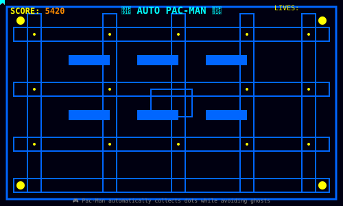

  

  

# 💫 About Me:

Hello! I'm **Arnab Kumar Dey**, a passionate Full-Stack Developer and AI enthusiast with a love for creating innovative solutions and exploring cutting-edge technologies.

🔭 **Currently Working On:** Personal projects involving AI/ML and full-stack web development  
🌱 **Currently Learning:** Advanced AI & Machine Learning, Cloud Technologies, and Modern Web Frameworks  
👯 **Looking to Collaborate:** Open source projects, AI/ML research, and innovative web applications  
📝 **Content Creator:** Regular technical articles on [Medium](https://medium.com/@arnabkumardey12062005)  
💬 **Ask Me About:** Python, JavaScript, Machine Learning, Web Development, and Data Science  
📫 **Reach Me:** arnabkumardey9957@gmail.com  
⚡ **Fun Fact:** I love automating everyday tasks and building interactive games!

---

## 🌐 Connect With Me:

 
 
 
 

 
 
 

 

---

## 🧩 LeetCode Profile:

<table>
  <tr>
    <td>
      
    </td>
    <td>
      
    </td>
  </tr>
  <tr>
    <td>
      
    </td>
    <td>
      
    </td>
  </tr>
</table>

---

## 💻 Tech Stack:

### 🚀 Programming Languages
 
 
 
 
 
 

### 🎨 Frontend Development
 
 
 
 
 
 

### ⚙️ Backend Development
 
 
 

### ☁️ Cloud & Deployment
 
 

### 🤖 AI/ML & Data Science
 
 
 
 

### 🛠️ Tools & Others
 
 
 
 
 
 

---

## 📊 GitHub Stats:

  
<table>
  <tr>
    <td>
      
    </td>
    <td>
      
    </td>
  </tr>
  <tr>
    <td colspan="2" align="center">
      
    </td>
  </tr>
</table>

---

## 🏆 GitHub Trophies

---

## 🎮 Interactive Elements

### Auto-Playing Pac-Man Game

*🤖 Watch Pac-Man automatically navigate the maze, collect dots, and avoid ghosts!*

---

### ✍️ Random Dev Quote

---

## 📈 GitHub Activity Graph

---

## 🔝 Top Contributed Repositories

---

## 💼 Current Projects & Interests

- 🤖 **AI/ML Projects**: Working on machine learning models for data analysis and prediction
- 🌐 **Full-Stack Development**: Building responsive web applications with modern frameworks
- 📊 **Data Science**: Exploring data visualization and statistical analysis
- 🔧 **Automation**: Creating tools to automate repetitive tasks and improve productivity
- 📚 **Content Creation**: Writing technical articles and sharing knowledge through blogs

---

### Thanks for visiting my profile! Let's connect and build something amazing together! 🚀

